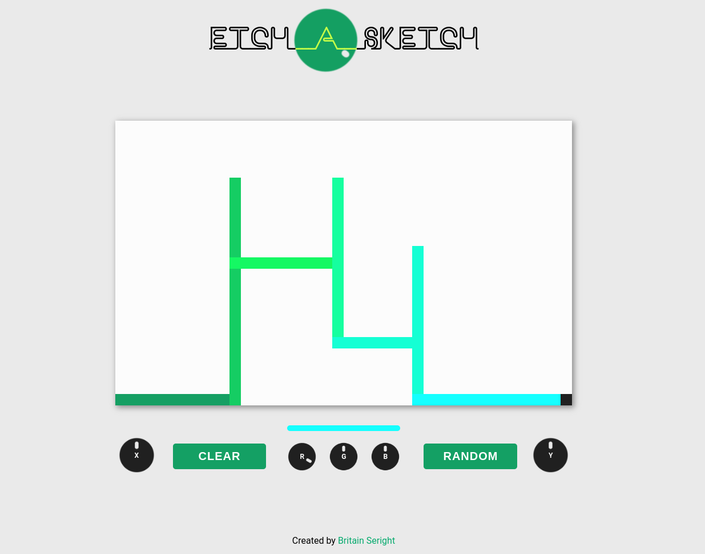

# Etch A Sketch
> An interactive Etch A Sketch with scrollable knobs that alter the current position and color. 
> Live demo [_here_](https://bseright.github.io/etch-a-sketch/).

## Table of Contents
* [General Info](#general-information)
* [Technologies Used](#technologies-used)
* [Features](#features)
* [Screenshots](#screenshots)
* [Room for Improvement](#room-for-improvement)
* [Contact](#contact)

## General Information
- The grid is created in the DOM and assigned a column & row class through a loop. 
- Assigned classes allow the user to manipulate the grid in an expected manner. 
- The knobs detect scroll direction with an overlayed, transparent, and scrollable div.
- The scrolled element is measured from the top of the browser and compared to the previous measurement.
- Scroll direction allows the knob to increase/decrease the corresponding value with clockwise/counterclockwise rotation.
- The overlayed "secret" divs don't allow for hover animations through CSS.
- Animation classes are added/removed with JS upon hovering the secret divs. 
- Color selecton is possible through RGB knob manipulation or by random button. 
- RGB knobs are animated to reflect the randomized color.

## Technologies Used
- HTML
- CSS
- Javascript

## Screenshots

## Room for Improvement
- Adding "How to Use" tooltips or description.
- Ending functions and animations when another event is detected. 
- Design improvements... I am not terribly excited about this design.
- Smoother/better animation.

## Contact
Created by Britain Seright ([@bseright](https://github.com/bseright))

Feel free to contact me!  
Email: britainseright@gmail.com
